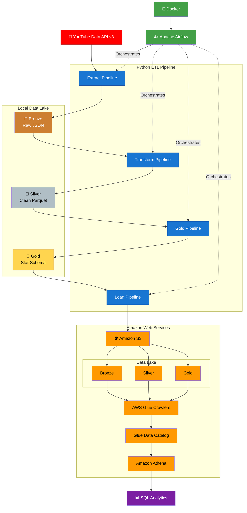

# 📺 YouTube Data Engineering Pipeline

An end-to-end **Data Engineering Pipeline** that extracts data from the **YouTube Data API v3**, transforms it using the **Medallion Architecture (Bronze → Silver → Gold)**, stores it in **Amazon S3**, catalogs data with **AWS Glue**, queries data using **Amazon Athena**, and orchestrates the entire workflow with **Apache Airflow** running in **Docker**.

---

## 🚀 Project Overview

This project demonstrates how to build a production-style batch data pipeline using modern Data Engineering tools and AWS services.

The pipeline performs the following tasks:

- Extracts channel, video, metadata, and statistics from the YouTube Data API
- Stores raw JSON data in the Bronze layer
- Cleans and transforms data into Parquet format in the Silver layer
- Builds a Star Schema (Dimensions & Fact Table) in the Gold layer
- Uploads all datasets to Amazon S3
- Automatically updates the AWS Glue Data Catalog using Glue Crawlers
- Enables SQL analytics using Amazon Athena
- Orchestrates the complete ETL workflow with Apache Airflow running in Docker

---

## 🛠 Tech Stack

| Category | Technologies |
|----------|--------------|
| Programming | Python 3 |
| Workflow Orchestration | Apache Airflow |
| Containerization | Docker & Docker Compose |
| Cloud | AWS |
| Storage | Amazon S3 |
| Metadata Catalog | AWS Glue |
| Query Engine | Amazon Athena |
| Secrets Management | AWS Secrets Manager |
| Data Processing | Pandas |
| File Formats | JSON, Parquet |
| Version Control | Git & GitHub |

---

## 🏗️ Architecture



---
## 🔄 Project Workflow

The pipeline follows a modern Medallion Architecture (Bronze → Silver → Gold) and is orchestrated using Apache Airflow.

### 1. Extract

- Connects to the YouTube Data API v3
- Retrieves:
  - Channel Details
  - Videos
  - Video Statistics
  - Pipeline Metadata
- Saves raw data locally as JSON

### 2. Transform (Bronze → Silver)

- Cleans raw JSON data
- Handles missing values
- Flattens nested objects
- Standardizes column names
- Converts data types
- Stores optimized Parquet files

### 3. Gold Layer

Creates an analytical Star Schema consisting of:

#### Dimension Tables

- **dim_channel**
- **dim_video**
- **dim_date**

#### Fact Table

- **fact_video_performance**

### 4. Load

- Uploads Bronze, Silver, and Gold datasets to Amazon S3
- Preserves the data lake folder structure

### 5. AWS Glue

- Crawlers automatically discover schemas
- Updates the AWS Glue Data Catalog

### 6. Amazon Athena

- Executes SQL queries directly on the S3 Data Lake
- Supports analytics without moving data

### 7. Apache Airflow

The complete workflow is automated using Apache Airflow running in Docker.

```
Extract
    ↓
Transform
    ↓
Gold
    ↓
Load to Amazon S3
    ↓
Run Glue Crawlers
    ↓
Update Glue Catalog
    ↓
Query using Athena
```
---
## 📁 Project Structure

```text
youtube-data-engineering-pipeline/
│
├── airflow/                    # Apache Airflow (Docker)
│   ├── dags/
│   ├── docker-compose.yaml
│   ├── Dockerfile
│   └── requirements.txt
│
├── clients/                    # API clients
│   └── youtube_client.py
│
├── config/                     # Configuration & Secrets Manager
│   ├── paths.py
│   ├── settings.py
│   └── secrets_manager.py
│
├── data/
│   ├── bronze/
│   ├── silver/
│   └── gold/
│
├── docs/                       # Architecture diagrams & screenshots
│
├── extractors/                 # Data extraction modules
│   ├── channel_extractor.py
│   ├── metadata_extractor.py
│   ├── video_extractor.py
│   └── video_statistics_extractor.py
│
├── loaders/                    # Local & S3 loaders
│   ├── bronze_loader.py
│   ├── silver_loader.py
│   ├── gold_loader.py
│   └── s3_loader.py
│
├── pipeline/                   # ETL pipelines
│   ├── extract_pipeline.py
│   ├── transform_pipeline.py
│   ├── gold_pipeline.py
│   └── load_pipeline.py
│
├── transform/
│   ├── bronze_to_silver.py
│   └── silver_to_gold.py
│
├── utils/                      # Logging & helper utilities
│
├── tests/                      # Test scripts
│
├── main.py                     # Local pipeline entry point
├── requirements.txt
├── README.md
└── LICENSE
```
---
## 🥉🥈🥇 Medallion Architecture

The pipeline implements a **three-layer Medallion Architecture** to organize and progressively refine data for analytics.

### 🥉 Bronze Layer (Raw Data)

The Bronze layer stores raw data extracted directly from the YouTube Data API without applying business transformations.

**Characteristics**

- Raw JSON files
- Immutable source data
- Partitioned by execution date
- Used as the source for downstream processing

**Datasets**

- Channel
- Videos
- Video Statistics
- Pipeline Metadata

**Storage Format**

```
JSON
```

**Example**

```text
bronze/
├── channel/
├── videos/
├── video_statistics/
└── metadata/
```

---

### 🥈 Silver Layer (Cleaned Data)

The Silver layer contains cleaned and standardized datasets ready for analytical modeling.

**Transformations**

- Flatten nested JSON objects
- Handle missing values
- Rename columns using snake_case
- Standardize data types
- Remove unnecessary fields
- Convert JSON to Parquet

**Storage Format**

```
Parquet
```

**Example**

```text
silver/
├── channel/
├── videos/
└── video_statistics/
```

---

### 🥇 Gold Layer (Business Layer)

The Gold layer contains business-ready datasets modeled as a **Star Schema** for efficient analytical queries.

The pipeline creates:

### Dimension Tables

- `dim_channel`
- `dim_video`
- `dim_date`

### Fact Table

- `fact_video_performance`

**Fact Measures**

- View Count
- Like Count
- Comment Count
- Duration (seconds)

**Storage Format**

```
Parquet
```

**Example**

```text
gold/
├── dimensions/
│   ├── dim_channel.parquet
│   ├── dim_video.parquet
│   └── dim_date.parquet
│
└── facts/
    └── fact_video_performance.parquet
```

---

### Benefits of the Medallion Architecture

- Separation of raw and curated data
- Improved data quality
- Faster analytical queries using Parquet
- Scalable data lake design
- Reusable datasets for downstream analytics
- Simplified maintenance and debugging

---
## ⭐ Star Schema

The Gold layer follows a **Star Schema** design to support efficient analytical queries in Amazon Athena.

### Schema Overview

```text
                    dim_date
                   ┌──────────────┐
                   │  date_key PK │
                   │  full_date   │
                   │  day         │
                   │  month       │
                   │  quarter     │
                   │  year        │
                   │  weekday     │
                   └──────┬───────┘
                          │
                          │
                          │
        ┌─────────────────┼──────────────────┐
        │                 │                  │
        ▼                 ▼                  ▼
               fact_video_performance
        ┌────────────────────────────────────────┐
        │ video_key FK                           │
        │ date_key FK                            │
        │ view_count                             │
        │ like_count                             │
        │ comment_count                          │
        │ duration_seconds                       │
        └────────────────────────────────────────┘
                          ▲
                          │
                          │
                   ┌──────┴───────┐
                   │ dim_video    │
                   │──────────────│
                   │ video_key PK │
                   │ channel_key  │
                   │ video_id     │
                   │ title        │
                   │ description  │
                   │ published_at │
                   │ thumbnail    │
                   └──────┬───────┘
                          │
                          │
                          ▼
                  ┌────────────────┐
                  │ dim_channel    │
                  │────────────────│
                  │ channel_key PK │
                  │ channel_id     │
                  │ channel_title  │
                  │ country        │
                  │ subscribers    │
                  │ views          │
                  │ videos         │
                  └────────────────┘
```

---

### Dimension Tables

#### `dim_channel`

Contains channel-level information.

| Column | Description |
|---------|-------------|
| channel_key | Surrogate primary key |
| channel_id | YouTube channel ID |
| channel_title | Channel name |
| country | Channel country |
| subscriber_count | Total subscribers |
| view_count | Total channel views |
| video_count | Total uploaded videos |

---

#### `dim_video`

Contains video metadata.

| Column | Description |
|---------|-------------|
| video_key | Surrogate primary key |
| video_id | YouTube video ID |
| channel_key | Foreign key to `dim_channel` |
| title | Video title |
| description | Video description |
| published_at | Publish timestamp |
| thumbnail_url | Thumbnail image URL |

---

#### `dim_date`

Calendar dimension used for time-based analytics.

| Column | Description |
|---------|-------------|
| date_key | YYYYMMDD |
| full_date | Calendar date |
| day | Day of month |
| month | Month number |
| month_name | Month name |
| quarter | Quarter |
| year | Calendar year |
| weekday | Day name |
| is_weekend | Weekend indicator |

---

### Fact Table

#### `fact_video_performance`

Stores measurable performance metrics for each video.

| Column | Description |
|---------|-------------|
| video_key | Foreign key to `dim_video` |
| date_key | Foreign key to `dim_date` |
| view_count | Total views |
| like_count | Total likes |
| comment_count | Total comments |
| duration_seconds | Video duration in seconds |

---

### Analytical Benefits

The Star Schema enables efficient SQL queries such as:

- Most viewed videos
- Most liked videos
- Channel performance
- Monthly upload trends
- Engagement analysis
- Content performance over time
- Year-over-year analysis
- Weekend vs weekday publishing trends

---
## 🌬️ Apache Airflow Orchestration

The ETL workflow is fully automated using **Apache Airflow** running inside **Docker**. The DAG orchestrates the complete data pipeline from extraction to loading into AWS.

### DAG Workflow

```text
                +----------------+
                |    Extract     |
                +----------------+
                         │
                         ▼
                +----------------+
                |   Transform    |
                +----------------+
                         │
                         ▼
                +----------------+
                |     Gold       |
                +----------------+
                         │
                         ▼
                +----------------+
                |     Load       |
                +----------------+
```

---

### DAG Tasks

| Task | Description |
|------|-------------|
| **Extract** | Fetches channel, videos, video statistics, and metadata from the YouTube Data API |
| **Transform** | Converts Bronze JSON into cleaned Silver Parquet datasets |
| **Gold** | Builds Star Schema (Dimension & Fact tables) |
| **Load** | Uploads Bronze, Silver, and Gold datasets to Amazon S3 |

---

### Scheduling

| Property | Value |
|----------|-------|
| Scheduler | Apache Airflow |
| Deployment | Docker Compose |
| Executor | CeleryExecutor |
| Schedule | Manual (can be changed to `@daily`) |
| Catchup | Disabled |

---

### Airflow Features

- Dockerized deployment
- Modular ETL pipelines
- Task dependency management
- Automatic retry support (configurable)
- Centralized logging
- AWS Secrets Manager integration
- AWS credentials mounted securely into containers

---

### Airflow Project Structure

```text
airflow/
├── dags/
│   └── youtube_pipeline_dag.py
├── logs/
├── plugins/
├── Dockerfile
├── docker-compose.yaml
└── requirements.txt
```

---

### DAG Definition

```text
Extract
    ↓
Transform
    ↓
Gold
    ↓
Load
```

Each task executes independently and passes control to the next stage only after successful completion, ensuring reliable pipeline execution.

---

### Airflow User Interface

The Airflow web interface provides:

- DAG monitoring
- Manual pipeline execution
- Task status tracking
- Execution logs
- Retry management
- Historical DAG runs

> 📸 **Screenshot Placeholder:** Airflow DAG Graph View

---
## ☁️ AWS Services

This project leverages multiple AWS services to build a scalable cloud-based data lake and analytics platform.

---

### 🔐 AWS Secrets Manager

Sensitive information is securely stored in **AWS Secrets Manager** instead of hardcoding credentials in the source code.

The pipeline retrieves the following secrets at runtime:

- YouTube API Key
- Channel Handle
- AWS Region
- Amazon S3 Bucket Name

**Benefits**

- Secure credential management
- No hardcoded secrets
- Easy credential rotation
- Production-ready configuration

---

### 🪣 Amazon S3

Amazon S3 serves as the project's Data Lake.

All datasets are uploaded after each pipeline execution.

```text
S3 Bucket

youtube-data-engineering-pipeline/

├── bronze/
│   ├── channel/
│   ├── videos/
│   ├── video_statistics/
│   └── metadata/
│
├── silver/
│   ├── channel/
│   ├── videos/
│   └── video_statistics/
│
└── gold/
    ├── dimensions/
    │   ├── dim_channel.parquet
    │   ├── dim_video.parquet
    │   └── dim_date.parquet
    │
    └── facts/
        └── fact_video_performance.parquet
```

**Benefits**

- Durable cloud storage
- Cost-effective data lake
- Supports JSON and Parquet
- Native integration with Glue and Athena

---

### 🕷️ AWS Glue Crawlers

AWS Glue Crawlers automatically discover schemas from the datasets stored in Amazon S3.

Separate crawlers are configured for each Medallion layer:

- Bronze Crawler
- Silver Crawler
- Gold Crawler

These crawlers update the Glue Data Catalog after new data is uploaded.

---

### 📚 AWS Glue Data Catalog

The Glue Data Catalog stores metadata for all datasets.

Databases:

- `youtube_bronze_db`
- `youtube_silver_db`
- `youtube_gold_db`

This enables Athena to query data without manually defining table schemas.

---

### 🔍 Amazon Athena

Amazon Athena is used as the SQL query engine for analytics.

Example analyses include:

- Most viewed videos
- Most liked videos
- Videos with highest engagement
- Monthly publishing trends
- Channel performance
- Content analytics

Athena queries the Parquet datasets directly from Amazon S3 without requiring data movement or a dedicated database server.

---

### AWS Architecture Summary

| AWS Service | Purpose |
|-------------|---------|
| AWS Secrets Manager | Secure storage of API keys and configuration |
| Amazon S3 | Cloud-based Data Lake |
| AWS Glue Crawlers | Automatic schema discovery |
| AWS Glue Data Catalog | Centralized metadata repository |
| Amazon Athena | Serverless SQL analytics |

---

### AWS Workflow

```text
Python ETL Pipeline
        │
        ▼
Amazon S3 Data Lake
        │
        ▼
AWS Glue Crawlers
        │
        ▼
Glue Data Catalog
        │
        ▼
Amazon Athena
        │
        ▼
SQL Analytics
```
---
## 🚀 Getting Started

Follow these steps to set up and run the project locally.

---

### Prerequisites

Ensure the following tools are installed:

- Python 3.12+
- Docker Desktop
- Docker Compose
- AWS CLI
- Git

---

## Clone the Repository

```bash
git clone https://github.com/<your-username>/youtube-data-engineering-pipeline.git

cd youtube-data-engineering-pipeline
```

---

## Create a Virtual Environment

### Windows

```bash
python -m venv venv

venv\Scripts\activate
```

### Linux / macOS

```bash
python3 -m venv venv

source venv/bin/activate
```

---

## Install Dependencies

```bash
pip install -r requirements.txt
```

---

## Configure AWS CLI

Authenticate with your AWS account:

```bash
aws configure
```

Provide:

- AWS Access Key ID
- AWS Secret Access Key
- AWS Region
- Output Format

Verify your configuration:

```bash
aws sts get-caller-identity
```

---

## Create AWS Resources

Create the following resources before running the pipeline:

- Amazon S3 Bucket
- AWS Secrets Manager Secret
- AWS Glue Crawlers
- AWS Glue Databases

---

## Configure AWS Secrets Manager

Create a secret (for example, `Youtube-API-KEY`) containing:

```json
{
  "youtube_api_key": "YOUR_YOUTUBE_API_KEY",
  "channel_handle": "@your_channel",
  "aws_region": "YOUR_AWS_REGION",
  "s3_bucket": "YOUR_S3_BUCKET_NAME"
}
```

The pipeline retrieves these values securely at runtime.

---

## Run the Pipeline Locally

Execute the complete ETL pipeline:

```bash
python main.py
```

Pipeline execution order:

```text
Extract
    ↓
Transform
    ↓
Gold
    ↓
Load
```

---

## Run with Apache Airflow

Navigate to the Airflow directory:

```bash
cd airflow
```

Build the custom Docker image:

```bash
docker compose build
```

Start the Airflow environment:

```bash
docker compose up -d
```

Open the Airflow UI:

```text
http://localhost:8080
```

Default credentials:

```text
Username: airflow

Password: airflow
```

Enable the DAG and trigger it manually.

---

## Verify the Results

After the pipeline completes successfully:

- Bronze, Silver, and Gold datasets are uploaded to Amazon S3.
- AWS Glue Crawlers update the Glue Data Catalog.
- Tables are available in Amazon Athena for querying.

---

## Example Athena Query

```sql
SELECT
    v.title,
    f.view_count
FROM fact_video_performance f
JOIN dim_video v
ON f.video_key = v.video_key
ORDER BY f.view_count DESC
LIMIT 10;
```
---

## 🚀 Future Improvements

This project establishes a solid foundation for a modern data engineering pipeline. Potential enhancements include:

### Pipeline Enhancements

- [ ] Incremental data loading to process only newly published videos
- [ ] Change Data Capture (CDC) for updating existing records
- [ ] Data quality validation using Great Expectations
- [ ] Automated unit and integration tests with CI/CD
- [ ] Email or Slack notifications for pipeline failures
- [ ] Parameterize the pipeline to support multiple YouTube channels
- [ ] Add configurable retry policies and alerting in Airflow

---

### Cloud Enhancements

- [ ] Deploy Apache Airflow on AWS MWAA
- [ ] Use AWS Lambda to trigger Glue Crawlers after uploads
- [ ] Schedule AWS Glue Jobs for cloud-native transformations
- [ ] Store Terraform or AWS CloudFormation templates for infrastructure provisioning
- [ ] Enable S3 lifecycle policies for cost optimization

---

### Analytics Enhancements

- [ ] Build interactive dashboards with Amazon QuickSight or Power BI
- [ ] Add video engagement metrics (Engagement Rate, Like Ratio, Comment Ratio)
- [ ] Track subscriber growth over time
- [ ] Analyze upload frequency and publishing trends
- [ ] Create top-performing content reports by month and year

---

### Data Engineering Best Practices

- [ ] Add comprehensive logging and monitoring
- [ ] Implement data versioning
- [ ] Partition Gold datasets for improved Athena performance
- [ ] Add schema evolution handling
- [ ] Integrate with Apache Spark for large-scale data processing
- [ ] Containerize the ETL application for deployment to Kubernetes or Amazon ECS

---

## 📄 License

This project is licensed under the MIT License. See the `LICENSE` file for details.

---

## 👨‍💻 Author

**Obul Reddy**

- GitHub: https://github.com/<Obulreddy0>

---

## ⭐ Support

If you found this project useful, consider giving it a ⭐ on GitHub.
